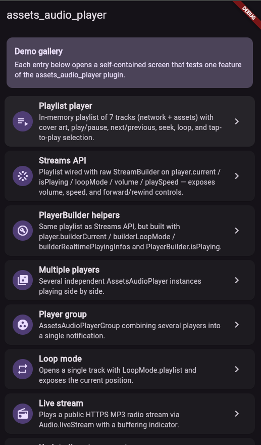
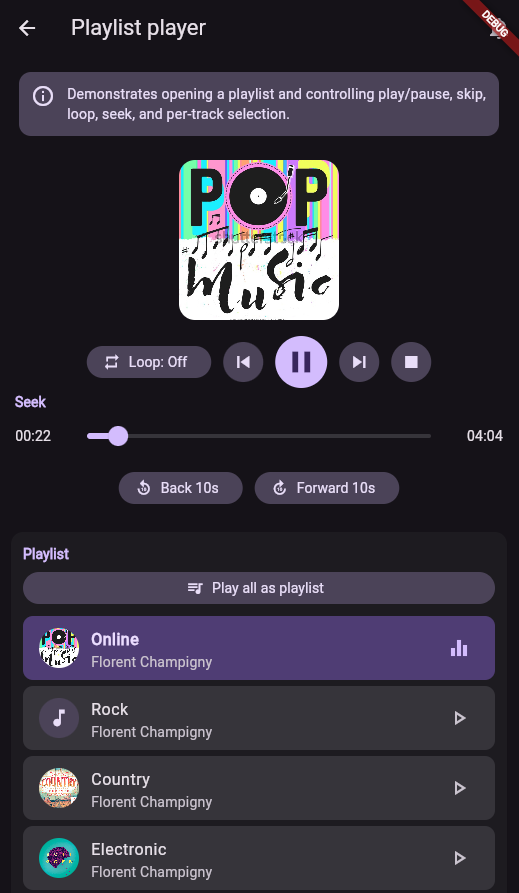
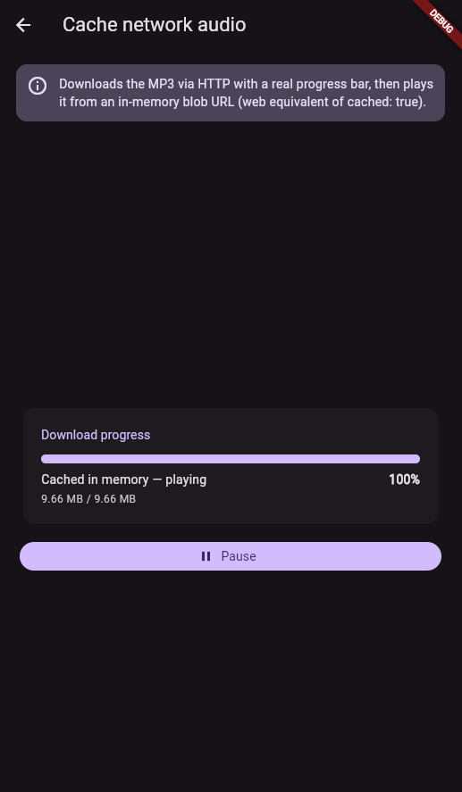
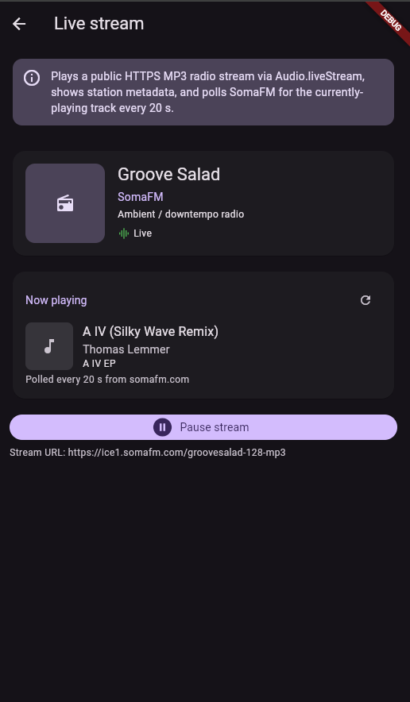
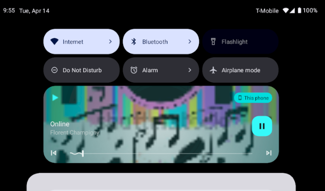
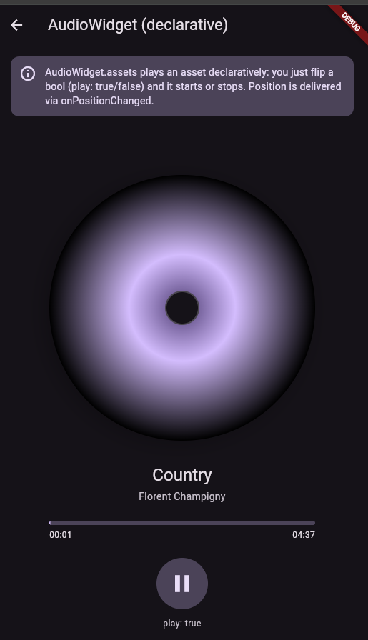

# 🎧 assets_audio_player_plus 🔊

[](https://pub.dartlang.org/packages/assets_audio_player_plus)
<a href="https://github.com/Solido/awesome-flutter">

</a>


[](https://www.fiverr.com/toptutorial270)

> ### 📢 Project status
> This repository is a **continuation** of the original
> [`assets_audio_player`](https://github.com/florent37/Flutter-AssetsAudioPlayer)
> plugin by Florent Champigny. It is actively maintained by **Zakria Khan**.
>
> Recent work includes restoring web support (migrated from `dart:html` to
> `package:web` + `dart:js_interop` for WebAssembly compatibility), modernizing
> the example app to Material 3, and fixing a number of long-standing bugs.
>
> **Pull requests are welcome.** Please read
> [CONTRIBUTING.md](./CONTRIBUTING.md) before opening one.
>
> ### ✅ Platform test status
>
> | Platform | Status | Notes |
> |---|---|---|
> | 🌐 Web (Chrome, JS)   | ✅ Tested | All 14 demos verified end-to-end |
> | 🌐 Web (WASM)         | ✅ Tested | `flutter build web --wasm` clean |
> | 🤖 Android            | ✅ Tested | Emulator SDK 36, API channels all OK |
> | 🍎 iOS                | ⏳ Pending | To be tested soon |
> | 🖥️ macOS              | ⏳ Pending | To be tested soon |
> | 🐧 Linux              | ⏳ Pending | Community contributions welcome |
> | 🪟 Windows            | ⏳ Pending | Community contributions welcome |
>
> 📦 Repo: [github.com/cyclone-pk/assets_audio_player_plus](https://github.com/cyclone-pk/assets_audio_player_plus)
>
> Found a bug on a tested platform? [Open an issue](https://github.com/cyclone-pk/assets_audio_player_plus/issues) with the demo that fails and your `flutter doctor -v` output.

Play music/audio stored in assets files (simultaneously) directly from Flutter (android / ios / web / macos).

You can also use play audio files from **network** using their url, **radios/livestream** and **local files**

**Notification can be displayed on Android & iOS, and bluetooth actions are handled**

```yaml
flutter:
  assets:
    - assets/audios/
```

```Dart
AssetsAudioPlayer.newPlayer().open(
    Audio("assets/audios/song1.mp3"),
    autoStart: true,
    showNotification: true,
);
```

<p align="center">
  
  
  
  
</p>

# 📥 Import

```yaml
dependencies:
  assets_audio_player_plus: ^3.2.0
```

**Works with `flutter: ">=3.3.0"`, be sure to upgrade your sdk**

You like the package ? buy me a kofi :)

<a href='https://ko-fi.com/A160LCC' target='_blank'></a>

<table>
    <thead>
        <tr>
            <th>Audio Source</th>
            <th>Android</th>
            <th>iOS</th>
            <th>Web</th>
            <th>MacOS</th>
        </tr>
    </thead>
    <tbody>
        <tr>
          <td>🗄️ Asset file (asset path)</td>
          <td>✅</td>
          <td>✅</td>
          <td>✅</td>
          <td>✅</td>
        </tr>
        <tr>
          <td>🌐 Network file (url)</td>
          <td>✅</td>
          <td>✅</td>
          <td>✅</td>
          <td>✅</td>
        </tr>
        <tr>
          <td>📁 Local file (path)</td>
          <td>✅</td>
          <td>✅</td>
          <td>✅</td>
          <td>✅</td>
        </tr>
        <tr>
          <td>📻 Network LiveStream / radio (url) <br/> (<b>Default, HLS, Dash, SmoothStream</b>)</td>
          <td>✅</td>
          <td>✅</td>
          <td>✅</td>
          <td>✅</td>
        </tr>
    </tbody>
</table>

<table>
    <thead>
        <tr>
            <th>Feature</th>
            <th>Android</th>
            <th>iOS</th>
            <th>Web</th>
            <th>MacOS</th>
        </tr>
    </thead>
    <tbody>
        <tr>
          <td>🎶 Multiple players</td>
          <td>✅</td>
          <td>✅</td>
          <td>✅</td>
          <td>✅</td>
        </tr>
        <tr>
          <td>💽 Open Playlist</td>
          <td>✅</td>
          <td>✅</td>
          <td>✅</td>
          <td>✅</td>
        </tr>
        <tr>
          <td>💬System notification</td>
          <td>✅</td>
          <td>✅</td>
          <td>🚫</td>
          <td>🚫</td>
        </tr>
        <tr>
          <td>🎧 Bluetooth actions</td>
          <td>✅</td>
          <td>✅</td>
          <td>🚫</td>
          <td>🚫</td>
        </tr>
        <tr>
          <td>🔕 Respect System silent mode</td>
          <td>✅</td>
          <td>✅</td>
          <td>🚫</td>
          <td>🚫</td>
        </tr>
        <tr>
          <td>📞 Pause on phone call</td>
          <td>✅</td>
          <td>✅</td>
          <td>🚫</td>
          <td>🚫</td>
        </tr>
    </tbody>
</table>

<table>
    <thead>
        <tr>
            <th>Commands</th>
            <th>Android</th>
            <th>iOS</th>
            <th>Web</th>
            <th>MacOS</th>
        </tr>
    </thead>
    <tbody>
        <tr>
          <td>▶ Play</td>
          <td>✅</td>
          <td>✅</td>
          <td>✅</td>
          <td>✅</td>
        </tr>
        <tr>
          <td>⏸ Pause</td>
          <td>✅</td>
          <td>✅</td>
          <td>✅</td>
          <td>✅</td>
        </tr>
        <tr>
          <td>⏹ Stop</td>
          <td>✅</td>
          <td>✅</td>
          <td>✅</td>
          <td>✅</td>
        </tr>
        <tr>
          <td>⏩ Seek(position)</td>
          <td>✅</td>
          <td>✅</td>
          <td>✅</td>
          <td>✅</td>
        </tr>
        <tr>
          <td>⏪⏩ SeekBy(position)</td>
          <td>✅</td>
          <td>✅</td>
          <td>✅</td>
          <td>✅</td>
        </tr>
        <tr>
          <td>⏩ Forward(speed)</td>
          <td>✅</td>
          <td>✅</td>
          <td>✅</td>
          <td>✅</td>
        </tr>
        <tr>
          <td>⏪ Rewind(speed)</td>
          <td>✅</td>
          <td>✅</td>
          <td>✅</td>
          <td>✅</td>
        </tr>
        <tr>
          <td>⏭ Next</td>
          <td>✅</td>
          <td>✅</td>
          <td>✅</td>
          <td>✅</td>
        </tr>
        <tr>
           <td>⏮ Prev</td>
           <td>✅</td>
           <td>✅</td>
           <td>✅</td>
           <td>✅</td>
        </tr>
    </tbody>
</table>

<table>
    <thead>
        <tr>
            <th>Widgets</th>
            <th>Android</th>
            <th>iOS</th>
            <th>Web</th>
            <th>MacOS</th>
        </tr>
    </thead>
    <tbody>
        <tr>
           <td>🐦 Audio Widget</td>
           <td>✅</td>
           <td>✅</td>
           <td>✅</td>
           <td>✅</td>
        </tr>
        <tr>
            <td>🐦 Widget Builders</td>
            <td>✅</td>
            <td>✅</td>
            <td>✅</td>
            <td>✅</td>
        </tr>
        <tr>
             <td>🐦 AudioPlayer Builders Extension</td>
             <td>✅</td>
             <td>✅</td>
             <td>✅</td>
             <td>✅</td>
         </tr>
    </tbody>
</table>

<table>
    <thead>
        <tr>
            <th>Properties</th>
            <th>Android</th>
            <th>iOS</th>
            <th>Web</th>
            <th>MacOS</th>
        </tr>
    </thead>
    <tbody>
        <tr>
          <td>🔁 Loop</td>
          <td>✅</td>
          <td>✅</td>
          <td>✅</td>
          <td>✅</td>
        </tr>
        <tr>
          <td>🔀 Shuffle</td>
          <td>✅</td>
          <td>✅</td>
          <td>✅</td>
          <td>✅</td>
        </tr>
        <tr>
          <td>🔊 get/set Volume</td>
          <td>✅</td>
          <td>✅</td>
          <td>✅</td>
          <td>✅</td>
        </tr>
        <tr>
          <td>⏩ get/set Play Speed</td>
          <td>✅</td>
          <td>✅</td>
          <td>✅</td>
          <td>✅</td>
        </tr>
	<tr>
          <td>⏩ get/set Pitch</td>
          <td>✅</td>
          <td>🚫</td>
          <td>🚫</td>
          <td>🚫</td>
        </tr>
    </tbody>
</table>

<table>
    <thead>
        <tr>
            <th>Listeners</th>
            <th>Android</th>
            <th>iOS</th>
            <th>Web</th>
            <th>MacOS</th>
        </tr>
    </thead>
    <tbody>
        <tr>
          <td>🦻 Listener onReady(completeDuration)</td>
          <td>✅</td>
          <td>✅</td>
          <td>✅</td>
          <td>✅</td>
        </tr>
        <tr>
           <td>🦻 Listener currentPosition</td>
           <td>✅</td>
           <td>✅</td>
           <td>✅</td>
           <td>✅</td>
        </tr>
        <tr>
          <td>🦻 Listener finished</td>
          <td>✅</td>
          <td>✅</td>
          <td>✅</td>
          <td>✅</td>
        </tr>
        <tr>
           <td>🦻 Listener buffering</td>
           <td>✅</td>
           <td>✅</td>
           <td>✅</td>
           <td>✅</td>
        </tr>
        <tr>
          <td>🦻 Listener volume</td>
          <td>✅</td>
          <td>✅</td>
          <td>✅</td>
          <td>✅</td>
        </tr>
        <tr>
          <td>🦻Listener Play Speed</td>
          <td>✅</td>
          <td>✅</td>
          <td>✅</td>
          <td>✅</td>
        </tr>
	<tr>
          <td>🦻Listener Pitch</td>
          <td>✅</td>
          <td>🚫</td>
          <td>🚫</td>
          <td>🚫</td>
        </tr>
    </tbody>
</table>

# 📁 Import assets files

No needed to copy songs to a media cache, with assets_audio_player you can open them directly from the assets.

1. Create an audio directory in your assets (not necessary named "audios")
2. Declare it inside your pubspec.yaml

```yaml
flutter:
  assets:
    - assets/audios/
```

## 🛠️ Getting Started

```Dart
final assetsAudioPlayer = AssetsAudioPlayer();

assetsAudioPlayer.open(
    Audio("assets/audios/song1.mp3"),
);
```

You can also play _network songs_ from _url_

```Dart
final assetsAudioPlayer = AssetsAudioPlayer();

try {
    await assetsAudioPlayer.open(
        Audio.network("http://www.mysite.com/myMp3file.mp3"),
    );
} catch (t) {
    //mp3 unreachable
}
```

_LiveStream / Radio_ from _url_

**The main difference with network, if you pause/play, on livestream it will resume to present duration**

```Dart
final assetsAudioPlayer = AssetsAudioPlayer();

try {
    await assetsAudioPlayer.open(
        Audio.liveStream(MY_LIVESTREAM_URL),
    );
} catch (t) {
    //stream unreachable
}
```

And play _songs from file_

```Dart
//create a new player
final assetsAudioPlayer = AssetsAudioPlayer();

assetsAudioPlayer.open(
    Audio.file(FILE_URI),
);
```

for file uri, please look at https://pub.dev/packages/path_provider

```Dart
assetsAudioPlayer.playOrPause();
assetsAudioPlayer.play();
assetsAudioPlayer.pause();
```

```Dart
assetsAudioPlayer.seek(Duration to);
assetsAudioPlayer.seekBy(Duration by);
```

```Dart
assetsAudioPlayer.forwardRewind(double speed);
//if positive, forward, if negative, rewind
```

```Dart
assetsAudioPlayer.stop();
```

# Notifications

[](https://github.com/cyclone-pk/assets_audio_player_plus)

[](https://github.com/cyclone-pk/assets_audio_player_plus)

on iOS, it will use `MPNowPlayingInfoCenter`

1. Add metas inside your audio

```dart
final audio = Audio.network("/assets/audio/country.mp3",
    metas: Metas(
            title:  "Country",
            artist: "Florent Champigny",
            album: "CountryAlbum",
            image: MetasImage.asset("assets/images/country.jpg"), //can be MetasImage.network
          ),
   );
```

2. open with `showNotification: true`

```dart
_player.open(audio, showNotification: true)
```

## Custom notification

Custom icon (android only)

### By ResourceName

Make sure you added those icons inside your `android/res/drawable` **!!! not on flutter assets !!!!**

```dart
await _assetsAudioPlayer.open(
        myAudio,
        showNotification: true,
        notificationSettings: NotificationSettings(
            customStopIcon: AndroidResDrawable(name: "ic_stop_custom"),
            customPauseIcon: AndroidResDrawable(name:"ic_pause_custom"),
            customPlayIcon: AndroidResDrawable(name:"ic_play_custom"),
            customPrevIcon: AndroidResDrawable(name:"ic_prev_custom"),
            customNextIcon: AndroidResDrawable(name:"ic_next_custom"),
        )

```

And don't forget tell proguard to keep those resources for release mode

(part Keeping Resources)

https://sites.google.com/a/android.com/tools/tech-docs/new-build-system/resource-shrinking

```xml

<?xml version="1.0" encoding="utf-8"?>
<resources xmlns:tools="http://schemas.android.com/tools"
tools:keep="@drawable/ic_next_custom, @drawable/ic_prev_custom, @drawable/ic_pause_custom, @drawable/ic_play_custom, @drawable/ic_stop_custom"/>
```

### By Manifest

1. Add your icon into your android's `res` folder (android/app/src/main/res)

2. Reference this icon into your AndroidManifest (android/app/src/main/AndroidManifest.xml)

```xml
<meta-data
     android:name="assets.audio.player.notification.icon"
     android:resource="@drawable/ic_music_custom"/>
```

You can also change actions icons

```
<meta-data
    android:name="assets.audio.player.notification.icon.play"
    android:resource="@drawable/ic_play_custom"/>
<meta-data
    android:name="assets.audio.player.notification.icon.pause"
    android:resource="@drawable/ic_pause_custom"/>
<meta-data
    android:name="assets.audio.player.notification.icon.stop"
    android:resource="@drawable/ic_stop_custom"/>
<meta-data
    android:name="assets.audio.player.notification.icon.next"
    android:resource="@drawable/ic_next_custom"/>
<meta-data
    android:name="assets.audio.player.notification.icon.prev"
    android:resource="@drawable/ic_prev_custom"/>
```

## Handle notification click (android)

Add in main

```dart
AssetsAudioPlayer.setupNotificationsOpenAction((notification) {
    //custom action
    return true; //true : handled, does not notify others listeners
                 //false : enable others listeners to handle it
});
```

Then if you want a custom action on widget

```dart
AssetsAudioPlayer.addNotificationOpenAction((notification) {
   //custom action
   return false; //true : handled, does not notify others listeners
                 //false : enable others listeners to handle it
});
```

## Custom actions

You can enable/disable a notification action

```dart
open(AUDIO,
   showNotification: true,
   notificationSettings: NotificationSettings(
       prevEnabled: false, //disable the previous button

       //and have a custom next action (will disable the default action)
       customNextAction: (player) {
         print("next");
       }
   )

)
```

## Update audio's metas / notification content

After your audio creation, just call

```dart
audio.updateMetas(
       player: _assetsAudioPlayer, //add the player if the audio is actually played
       title: "My new title",
       artist: "My new artist",
       //if I not provide a new album, it keep the old one
       image: MetasImage.network(
         //my new image url
       ),
);
```

## Bluetooth Actions

You have to enable notification to make them work

Available remote commands :

- Play / Pause
- Next
- Prev
- Stop

## HeadPhone Strategy

(Only for Android for now)

while opening a song/playlist, add a strategy

```dart
assetsAudioPlayer.open(
   ...
  headPhoneStrategy: HeadPhoneStrategy.pauseOnUnplug,
  //headPhoneStrategy: HeadPhoneStrategy.none, //default
  //headPhoneStrategy: HeadPhoneStrategy.pauseOnUnplugPlayOnPlug,
)
```

If you want to make it work on bluetooth too, you'll have to add the BLUETOOTH permission inside your AndroidManifest.xml

```xml
<uses-permission android:name="android.permission.BLUETOOTH" />
```

# ⛓ Play in parallel / simultaneously

You can create new AssetsAudioPlayer using AssetsAudioPlayer.newPlayer(),
which will play songs in a different native Media Player

This will enable to play two songs simultaneously

You can have as many player as you want !

```dart
///play 3 songs in parallel
AssetsAudioPlayer.newPlayer().open(
    Audio("assets/audios/song1.mp3")
);
AssetsAudioPlayer.newPlayer().open(
    Audio("assets/audios/song2.mp3")
);

//another way, with create, open, play & dispose the player on finish
AssetsAudioPlayer.playAndForget(
    Audio("assets/audios/song3.mp3")
);
```

Each player has an unique generated `id`, you can retrieve or create them manually using

```dart
final player = AssetsAudioPlayer.withId(id: "MY_UNIQUE_ID");
```

# 🗄️ Playlist

```Dart
assetsAudioPlayer.open(
  Playlist(
    audios: [
      Audio("assets/audios/song1.mp3"),
      Audio("assets/audios/song2.mp3")
    ]
  ),
  loopMode: LoopMode.playlist //loop the full playlist
);

assetsAudioPlayer.next();
assetsAudioPlayer.prev();
assetsAudioPlayer.playlistPlayAtIndex(1);
```

## Audio Widget

If you want a more flutter way to play audio, try the `AudioWidget` !

<p align="center">
  
</p>

```dart
//inside a stateful widget

bool _play = false;

@override
Widget build(BuildContext context) {
  return AudioWidget.assets(
     path: "assets/audios/country.mp3",
     play: _play,
     child: RaisedButton(
           child: Text(
               _play ? "pause" : "play",
           ),
           onPressed: () {
               setState(() {
                 _play = !_play;
               });
           }
      ),
      onReadyToPlay: (duration) {
          //onReadyToPlay
      },
      onPositionChanged: (current, duration) {
          //onPositionChanged
      },
  );
}
```

How to 🛑 stop 🛑 the AudioWidget ?

Just remove the Audio from the tree !
Or simply keep `play: false`

## 🎧 Listeners

All listeners exposes Streams
Using RxDart, AssetsAudioPlayer exposes some listeners as ValueObservable (Observable that provides synchronous access to the last emitted item);

### 🎵 Current song

```Dart
//The current playing audio, filled with the total song duration
assetsAudioPlayer.current //ValueObservable<PlayingAudio>

//Retrieve directly the current played asset
final PlayingAudio playing = assetsAudioPlayer.current.value;

//Listen to the current playing song
assetsAudioPlayer.current.listen((playingAudio){
    final asset = playingAudio.assetAudio;
    final songDuration = playingAudio.duration;
})
```

### ⌛ Current song duration

```Dart
//Listen to the current playing song
final duration = assetsAudioPlayer.current.value.duration;
```

### ⏳ Current position (in seconds)

```Dart
assetsAudioPlayer.currentPosition //ValueObservable<Duration>

//retrieve directly the current song position
final Duration position = assetsAudioPlayer.currentPosition.value;

return StreamBuilder(
    stream: assetsAudioPlayer.currentPosition,
    builder: (context, asyncSnapshot) {
        final Duration duration = asyncSnapshot.data;
        return Text(duration.toString());
    }),
```

or use a PlayerBuilder !

```dart
PlayerBuilder.currentPosition(
     player: _assetsAudioPlayer,
     builder: (context, duration) {
       return Text(duration.toString());
     }
)
```

or Player Builder Extension

```dart
_assetsAudioPlayer.builderCurrentPosition(
     builder: (context, duration) {
       return Text(duration.toString());
     }
)
```

### ▶ IsPlaying

boolean observable representing the current mediaplayer playing state

```Dart
assetsAudioPlayer.isPlaying // ValueObservable<bool>

//retrieve directly the current player state
final bool playing = assetsAudioPlayer.isPlaying.value;

//will follow the AssetsAudioPlayer playing state
return StreamBuilder(
    stream: assetsAudioPlayer.isPlaying,
    builder: (context, asyncSnapshot) {
        final bool isPlaying = asyncSnapshot.data;
        return Text(isPlaying ? "Pause" : "Play");
    }),
```

or use a PlayerBuilder !

```dart
PlayerBuilder.isPlaying(
     player: _assetsAudioPlayer,
     builder: (context, isPlaying) {
       return Text(isPlaying ? "Pause" : "Play");
     }
)
```

or Player Builder Extension

```dart
_assetsAudioPlayer.builderIsPlaying(
     builder: (context, isPlaying) {
       return Text(isPlaying ? "Pause" : "Play");
     }
)
```

### 🔊 Volume

Change the volume (between 0.0 & 1.0)

```Dart
assetsAudioPlayer.setVolume(0.5);
```

The media player can follow the system "volume mode" (vibrate, muted, normal)
Simply set the `respectSilentMode` optional parameter as `true`

```dart
_player.open(PLAYABLE, respectSilentMode: true);
```

https://developer.android.com/reference/android/media/AudioManager.html?hl=fr#getRingerMode()

https://developer.apple.com/documentation/avfoundation/avaudiosessioncategorysoloambient

Listen the volume

```dart
return StreamBuilder(
    stream: assetsAudioPlayer.volume,
    builder: (context, asyncSnapshot) {
        final double volume = asyncSnapshot.data;
        return Text("volume : $volume");
    }),
```

or use a PlayerBuilder !

```dart
PlayerBuilder.volume(
     player: _assetsAudioPlayer,
     builder: (context, volume) {
       return Text("volume : $volume");
     }
)
```

### ✋ Finished

Called when the current song has finished to play,

it gives the Playing audio that just finished

```Dart
assetsAudioPlayer.playlistAudioFinished //ValueObservable<Playing>

assetsAudioPlayer.playlistAudioFinished.listen((Playing playing){

})
```

Called when the complete playlist has finished to play

```Dart
assetsAudioPlayer.playlistFinished //ValueObservable<bool>

assetsAudioPlayer.playlistFinished.listen((finished){

})
```

### 🔁 Looping

```Dart
final LoopMode loopMode = assetsAudioPlayer.loop;
// possible values
// LoopMode.none : not looping
// LoopMode.single : looping a single audio
// LoopMode.playlist : looping the fyll playlist

assetsAudioPlayer.setLoopMode(LoopMode.single);

assetsAudioPlayer.loopMode.listen((loopMode){
    //listen to loop
})

assetsAudioPlayer.toggleLoop(); //toggle the value of looping
```

### 🏃 Play Speed

```Dart
assetsAudioPlayer.setPlaySpeed(1.5);

assetsAudioPlayer.playSpeed.listen((playSpeed){
    //listen to playSpeed
})

//change play speed for a particular Audio

Audio audio = Audio.network(
    url,
    playSpeed: 1.5
);
assetsAudioPlayer.open(audio);
```

### 🎙️ Pitch

```Dart
assetsAudioPlayer.setPitch(1.2);

assetsAudioPlayer.pitch.listen((pitch){
    //listen to pitch
})

//change pitch for a particular Audio

Audio audio = Audio.network(
    url,
    pitch: 1.2
);
assetsAudioPlayer.open(audio);
```

# Error Handling

By default, on playing error, it stop the audio

BUT you can add a custom behavior

```dart
_player.onErrorDo = (handler){
  handler.player.stop();
};
```

Open another audio

```dart
_player.onErrorDo = (handler){
  handler.player.open(ANOTHER_AUDIO);
};
```

Try to open again on same position

```dart
_player.onErrorDo = (handler){
  handler.player.open(
      handler.playlist.copyWith(
        startIndex: handler.playlistIndex
      ),
      seek: handler.currentPosition
  );
};
```

# Network Policies (android/iOS/macOS)

Android only allow HTTPS calls, you will have an error if you're using HTTP,
don't forget to add INTERNET permission and seet `usesCleartextTraffic="true"` in your **AndroidManifest.xml**

```
<?xml version="1.0" encoding="utf-8"?>
<manifest ...>
    <uses-permission android:name="android.permission.INTERNET" />
    <application
        ...
        android:usesCleartextTraffic="true"
        ...>
        ...
    </application>
</manifest>
```

iOS only allow HTTPS calls, you will have an error if you're using HTTP,
don't forget to edit your **info.plist** and set `NSAppTransportSecurity` to `NSAllowsArbitraryLoads`

```
<key>NSAppTransportSecurity</key>
<dict>
    <key>NSAllowsArbitraryLoads</key>
    <true/>
</dict>
```

To enable http calls on macOs, you have to add input/output calls capabilities into `info.plist`

```
<key>NSAppTransportSecurity</key>
<dict>
    <key>NSAllowsArbitraryLoads</key>
    <true/>
</dict>
<key>UIBackgroundModes</key>
<array>
    <string>audio</string>
    <string>fetch</string>
</array>
<key>com.apple.security.network.client</key>
<true/>
```

and in your

`Runner/DebugProfile.entitlements`

add

```
<key>com.apple.security.network.client</key>
<true/>
```

Complete `Runner/DebugProfile.entitlements`

```
<?xml version="1.0" encoding="UTF-8"?>
<!DOCTYPE plist PUBLIC "-//Apple//DTD PLIST 1.0//EN" "http://www.apple.com/DTDs/PropertyList-1.0.dtd">
<plist version="1.0">
<dict>
	<key>com.apple.security.app-sandbox</key>
	<true/>
	<key>com.apple.security.cs.allow-jit</key>
	<true/>
	<key>com.apple.security.network.server</key>
	<true/>
	<key>com.apple.security.network.client</key>
	<true/>
</dict>
</plist>
```

# 🎶 Musics

All musics used in the samples came from https://www.freemusicarchive.org/

# 🤝 Contributing

Contributions are welcome — bug fixes, features, docs, tests, and examples.

### Workflow

1. **Open an issue first** for anything larger than a small fix, so we can agree
   on scope before you spend time on a PR.
2. **Fork & branch** off `master`. Use a descriptive branch name
   (`fix/web-double-audio`, `feat/pitch-on-ios`, `docs/contributing`).
3. **Keep the PR focused**. One concern per PR — mixing a refactor with a bug
   fix makes review much harder.
4. **Run the checks locally** before pushing:
   ```bash
   dart format --set-exit-if-changed .
   flutter analyze
   flutter test
   cd example && flutter analyze
   ```
5. **Open the PR** against `master`. The PR template will ask you to describe
   what changed, why, how you tested it, and on which platforms.

### What "comprehensive testing" means here

Because this package ships on five platforms (Android / iOS / macOS / Web /
Linux / Windows where applicable), a PR is expected to:

- Add or update **unit tests** in `test/` for any non-trivial Dart logic.
- Add or update the **example app** (`example/`) when changing a public API,
  so the change is runnable end-to-end.
- For platform-specific changes, include a short **manual test plan** in the
  PR description listing every platform you ran it on, with the Flutter
  version (`flutter --version` output).
- For web changes, test both DDC (`flutter run -d chrome`) and **WASM**
  (`flutter build web --wasm`).

### CI & review gates

Every PR runs an automated pipeline before a human looks at it. See
[`.github/workflows/ci.yml`](./.github/workflows/ci.yml) for the exact steps,
but the checks include:

- `dart format` (formatting must match)
- `flutter analyze` on the plugin, the web package, and the example
- `flutter test`
- `example/` builds for web (JS + WASM) and Android
- Dependabot keeps dependencies current

In addition:

- Branch protection on `master` requires **all CI checks to pass** and **at
  least one approving review** from a maintainer before merge.
- The CODEOWNERS file (`.github/CODEOWNERS`) routes reviews to the
  responsible maintainer automatically.
- External contributor PRs run with restricted secrets — release steps only
  fire after a maintainer approves.

### Releases

Releases are cut from `master` by a maintainer: bump the version in
`pubspec.yaml`, update `CHANGELOG.md`, tag `vX.Y.Z`, and publish to pub.dev.
Please **do not** bump the version in a PR yourself — that's a maintainer
step so the changelog stays coherent.

### Code of conduct

Be kind. No harassment, no personal attacks. Disagree with ideas, not
people. Maintainers reserve the right to close or lock threads that get
heated.
